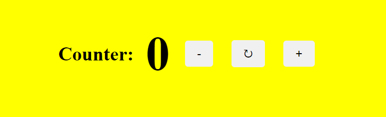

# Counter Project

## Description
This is a simple counter application built using **HTML, CSS, and JavaScript**. The user can increase, decrease, or reset the counter value using interactive buttons.

## Features
- Dynamic creation of elements using JavaScript
- Increment, decrement, and reset functionality
- Simple and clean UI with CSS styling
- Fully responsive design

## Technologies Used
- **HTML** for structuring the page
- **CSS** for styling the interface
- **JavaScript** for handling logic and DOM manipulation

## Project Structure
```
/progetto-javascript-Xian-Long-Qiu
│── /assets
│   └── /css
│   └── style.css
│   └── /img
│   └── counter.png
│── /js
│   ├── counter.js
│── index.html
│── README.md
```

## Installation & Usage
1. Clone the repository:
   ```bash
   git clone https://github.com/XLQdev/counter-javascript
   ```bash
2. Open `index.html` in a browser.

## How It Works

  

- Click `+` to increase the counter
- Click `-` to decrease the counter
- Click `↻` to reset the counter

## Author
**Qlx**


